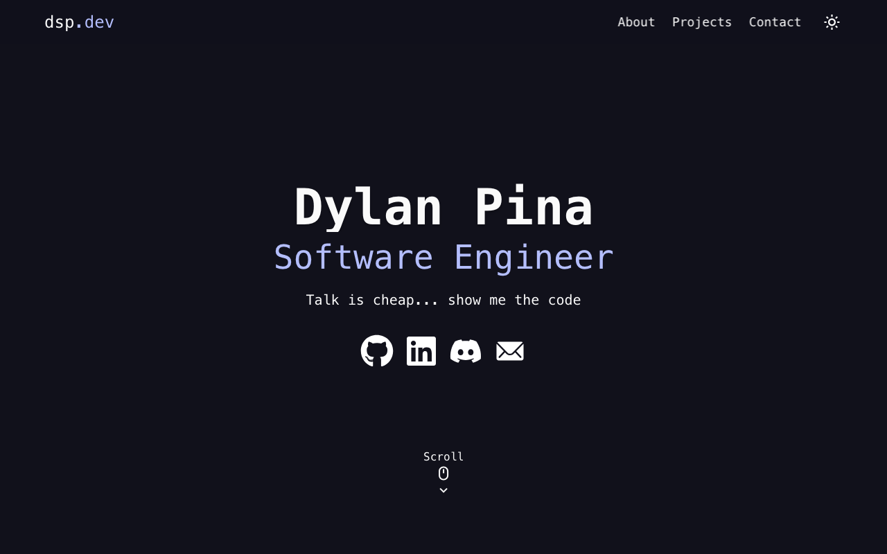

# www.dylansp.dev



## Overview

This is my personal developer portfolio website showcasing projects, blog posts, and professional background. It’s built with modern web technologies for performance, scalability, and maintainability.

---

## Stack

| Layer         | Technology          | Why I Chose It                                                                                 |
| ------------- | ------------------- | ---------------------------------------------------------------------------------------------- |
| **Framework** | **Next.js 14**      | Hybrid static + server-side rendering, file-based routing, and built-in SEO optimizations.     |
| **Language**  | **TypeScript**      | Type-safe components and API routes, improved DX with strict typing and editor autocompletion. |
| **Styling**   | **Tailwind CSS v3** | Utility-first approach for rapid, consistent UI development without leaving the markup.        |

---

## Infrastructure

> **All resources are defined in infrastructure-as-code (IaC) using AWS CDK (TypeScript).**

| Layer          | AWS Service(s)                 | Purpose                                                                                          |
| -------------- | ------------------------------ | ------------------------------------------------------------------------------------------------ |
| **DNS**        | Route 53                       | `A` and `AAAA` records point `dylansp.dev` and `www` to CloudFront.                              |
| **CDN / Edge** | CloudFront + Lambda@Edge       | Global caching of static assets and edge rendering for Next.js SSR (`/api/*` and dynamic pages). |
| **Storage**    | S3 (origin bucket)             | Stores static assets generated by `next build` (`_next/**`, images, fonts, etc.).                |
| **CI/CD**      | GitHub Actions → AWS CodeBuild | On every `main` push: lint → test → build → upload to S3 → invalidate CloudFront cache.          |
| **SSL/TLS**    | AWS Certificate Manager        | Free ACM certificate automatically attached to CloudFront for HTTPS everywhere.                  |

## Run Locally

> **Prerequisites:** Node ≥ 18, pnpm (or npm/yarn), and **optionally Docker** if you want to spin up a mock API.

1. **Clone the repo**

   ```bash
   git clone https://github.com/DylanPina/dsp.dev dspdev
   cd dspdev
   ```

2. **Install dependencies**

   ```bash
   pnpm install
   ```

3. **Run the development server**

   ```bash
   pnpm dev
   ```

4. **Open in browser**

   Navigate to `http://localhost:3000` to view the site. Any changes you make will automatically reload the page.
